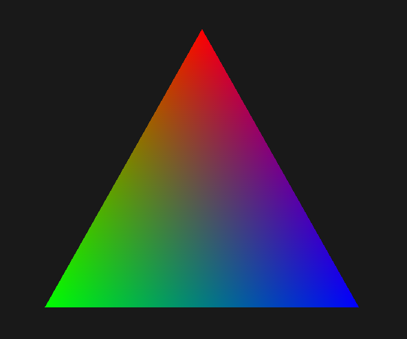
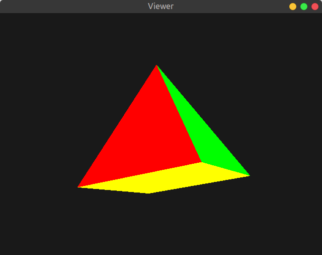

# Practical 2 - Meshes & Modelling

## Exercise 2. Vertex Array Wrapper

As taken from [this](http://morpheo.inrialpes.fr/~franco/3dgraphics/practical2.html#exercise-2-vertex-array-wrapper) link, we complete the class `Pyramid`'s functions `__init__(...)` and `__draw__(...)` by adding calls to the wrapper class `VertexArray`'s functions.

```py
self.array = VertexArray([position, color], self.index)
```

The class `VertexArray` automatically takes care of sending the data to the GPU side. We just have to provide it with the object's `position` coordinates, `colour` values, and a mapping of colour to coordinates points, `index`.

<p align="center">

</p>

The numbering of the vertices can be arbitrary but then must remain consistent with the mapping. For the above numbering, we made the `position`, `color` and `index` arrays as follows:

### Interpolated Colour Rendering
```py
# Interpolated colourful rendering
position = np.array(((-.5, 0, -.5), (-.5, 0, .5), (.5, 0, .5), (.5, 0, -.5), (0, 1, 0)), 'f')
color = np.array(((1, 1, 0), (0, 1, 0), (0, 0, 1), (1, 0, 1), (1, 0, 0)), 'f')
self.index = np.array((4,1,2, 4,2,3, 4,3,0, 4,0,1, 1,3,2, 1,0,3 ), np.uint32)
```

The mapping can be interpreted as follows:

```py
    Position         Array Index
(-.5, 0, -.5)    -->     0
(-.5, 0,  .5)    -->     1
(.5,  0,  .5)    -->     2
(.5,  0, -.5)    -->     3
(0,   1,   0)    -->     4
```
which corresponds to the mapping in the diagram that we had decided on. Similarly for colours, we decide on the following mapping. This is completely subjective, but once decided must be used as the reference point which we will see in the next explanation.

```py
(Y) (1, 1, 0)   -->     0   # Yellow
(G) (0, 1, 0)   -->     1   # Green
(B) (0, 0, 1)   -->     2   # Blue
(M) (1, 0, 1)   -->     3   # Magenta
(R) (1, 0, 0)   -->     4   # Red
```

Now in order to start colouring the triangle, we make use of `index` array. Every pair of 3 numbers represent a face of a triangle. These 3 numbers represent the index of the coordinates that we had decided on earlier. For example, `4,1,2` represents the front face of the triangle shown in the above pyramid diagram.

*__NOTE:__* The order of the these points must be in **anticlockwise** direction, hence the order `4,1,2`.

And so, for the rest of the numbers in index array, the interpretation is as follows:

```py
Pyramid Vertices        Colour Mapping
    4,1,2           -->     R, G, B
    4,2,3           -->     R, B, M
    4,3,0           -->     R, M, Y
    4,0,1           -->     R, Y, G
    1,3,2           -->     G, M, B
    1,0,3           -->     G, Y, M
```
The resultant would be colours having their origin at vertices, and gradually interpolating with each other. For example, for the face (`4,1,2`), the output is as follows:

<p align="center">

</p>

### Flat Colour Rendering

Flat rendering of colours is slightly more difficult. For every face of pyramid to have exactly 1 single colour, we have to make sure that all 3 vertices of that side of triangle have same colour value. But vertices in pyramid are shared. Then how do we ensure that all the 5 faces will have their own colour?

For this, we made the `position`, `color` and `index` arrays as follows:

```py
# Flat colours rendering
position = np.array(((-.5, 0, -.5), (-.5, 0, .5), (.5, 0, .5), (.5, 0, -.5), (0, 1, 0),
(-.5, 0, -.5), (-.5, 0, .5), (.5, 0, .5), (.5, 0, -.5), (0, 1, 0),
(-.5, 0, -.5), (-.5, 0, .5), (.5, 0, .5), (.5, 0, -.5), (0, 1, 0),
(0, 1, 0), (-.5, 0, .5), (.5, 0, -.5)), 'f')

color = np.array(((0, 0, 1), (1, 0, 0), (1, 0, 0), (0, 1, 0), (1, 0, 0),
(0, 1, 1), (0, 1, 1), (0, 1, 0), (0, 0, 1), (0, 1, 0),
(1, 1, 0), (1, 1, 0), (1, 1, 0), (1, 1, 0), (0, 0, 1),
(0, 1, 1), (1, 1, 0), (1, 1, 0)), 'f')

self.index = np.array((4,1,2, 9,7,3, 14,8,0, 15,5,6, 11,13,12, 16,10,17), np.uint32)
```

This slightly complicated mapping can be interpreted as follows:

```py
    Position         Array Index
(-.5, 0, -.5)    -->     0
(-.5, 0,  .5)    -->     1
(.5,  0,  .5)    -->     2
(.5,  0, -.5)    -->     3
(0,   1,   0)    -->     4

(-.5, 0, -.5)    -->     5
(-.5, 0,  .5)    -->     6
(.5,  0,  .5)    -->     7
(.5,  0, -.5)    -->     8
(0,   1,   0)    -->     9

(-.5, 0, -.5)    -->     10
(-.5, 0,  .5)    -->     11
(.5,  0,  .5)    -->     12
(.5,  0, -.5)    -->     13
(0,   1,   0)    -->     14

(0,   1,   0)    -->     15
(-.5, 0,  .5)    -->     16
(.5,  0, -.5)    -->     17
```
This mapping is done by wrapping around the numbering after 4, back to the starting vertex.
Hence each vertex has 3 different indices, except 3 vertices. THat's because every vertex is being shared by 3 different sides of a pyramid. The top vertex is being shared by 4 faces, and the 2 diagonal vertices are also technically being shared by 4 faces each.

<p align="center">

</p>

```py
    Colour
(B) (0, 0, 1)    -->     0
(R) (1, 0, 0)    -->     1
(R) (1, 0, 0)    -->     2
(G) (0, 1, 0)    -->     3
(R) (1, 0, 0)    -->     4
(C) (0, 1, 1)    -->     5
(C) (0, 1, 1)    -->     6
(G) (0, 1, 0)    -->     7
(B) (0, 0, 1)    -->     8
(G) (0, 1, 0)    -->     9
(Y) (1, 1, 0)    -->     10
(Y) (1, 1, 0)    -->     11
(Y) (1, 1, 0)    -->     12
(Y) (1, 1, 0)    -->     13
(B) (0, 0, 1)    -->     14
(C) (0, 1, 1)    -->     15
(Y) (1, 1, 0)    -->     16
(Y) (1, 1, 0)    -->     17
```

And now, we map the vertices (variable `index`) in the following manner:

```py
Pyramid Vertices        Colour Mapping
    4,1,2           -->     R, R, R
    9,7,3           -->     G, G, G
    14,8,0          -->     B, B, B
    15,5,6          -->     C, C, C
    11,13,12        -->     Y, Y, Y
    16,10,17        -->     Y, Y, Y
```

<p align="center">

</p>