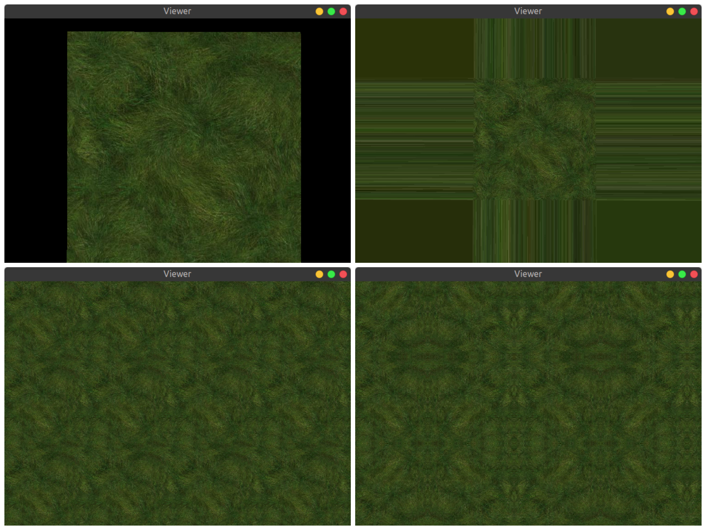
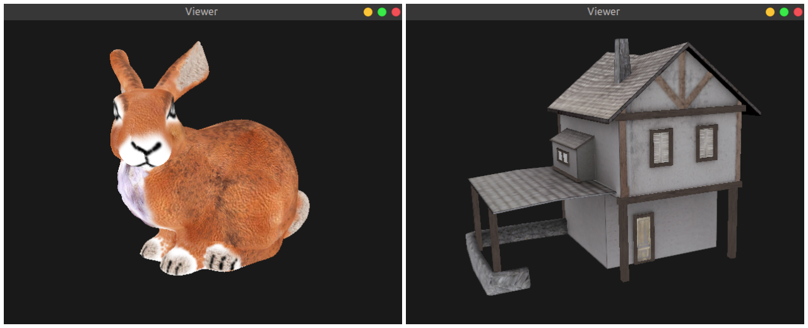

# Practical 5 - Texturing

## Code Review

We have the following classes defined:

* Texture
* TexturedPlane(Mesh)
* TexturedMesh(Mesh)

The function `load_textured(file, shader, texture)` takes in 3 parameters:
* The 3D object (`.obj`) file
* The shader
* The texture file (`.png`)

The `Texture` class takes in input in the form of png or jpg image and stores it as a texture in the GPU. It gets an array of all the pixels (`tex` variable) and uploads in the GPU (using `GL.glTexImage2D`).

## Outputs

### Exercise 1

Clockwise from top:

* Original grass texture (clamp to border)
* Edge based extension (clamp to edge)
* Mirrored repetition
* Repetition

### Exercise 2

Bunny and house object
